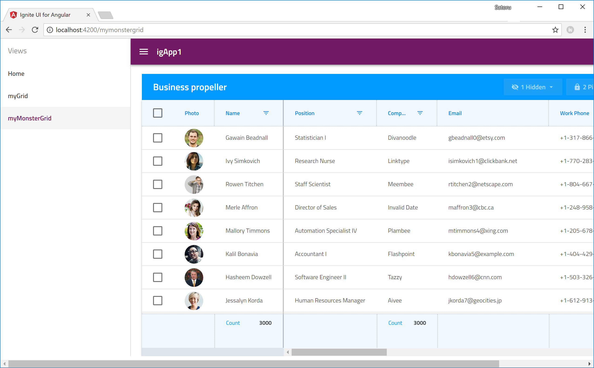

# Angular プロジェクトの作成と Ignite UI のインポート

## 概要
新規のAngularプロジェクトを作成し、更に Ignite UI for Angular のコンポーネントをプロジェクトに追加して利用できる状態にします。

## 手順
本ハンズオンでは「Ignite UI CLI ※１」を利用してAngularプロジェクトを生成します。このCLIツールを利用することでIgnite UI for Angularやその依存ライブラリのインストール/インポートを割愛し事前準備の時間短縮を図ります。

[Ignite UI for Angular を開始 (Ignite UI CLI利用)](https://jp.infragistics.com/products/ignite-ui-angular/getting-started#tab-ignite-ui-cli)

※１ Ignite UI CLI：インフラジスティックスが提供する、Ignite UI のインストール/インポートやそれらを使ったViewの作成を簡単に実現するためのCLIツールです。内部的に Angular CLI が使われています。

手順が完了し、アプリが動作すると以下の結果となります。

MonsterGridを選択して、どんな事ができるのか UI を触ってみましょう。

## 補足

Ignite UI CLI を利用せずに Angular CLI を利用して一からAngularプロジェクトの作成 ～ Ignite UI for Angular のインストールまで行う場合は、以下のWebページをご参考にして下さい。

[Ignite UI for Angular を開始 (npm利用)](https://jp.infragistics.com/products/ignite-ui-angular/getting-started#tab-npm)

## Next

[02-Componentの追加](02-Componentの追加.md)
