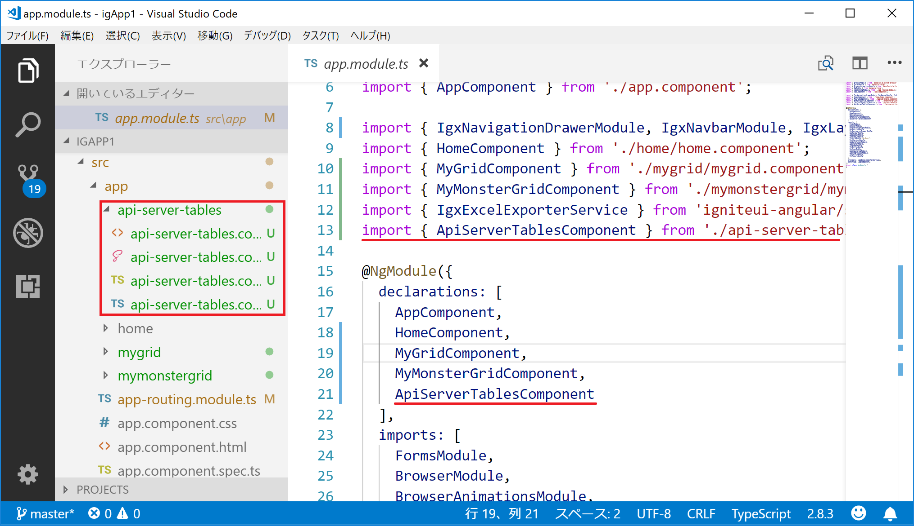

# Component の新規追加

ここでは、APIから取得したデータを表示するための Component を Angular CLI の ng コマンドを利用して作成します。

## Compoent の生成

まず、ng generate コマンドで api-server-tables という名前の Component を作成します。

```sh:console
$ ng generate component api-server-tables
```
すると Angular CLI が App フォルダ配下に api-server-tables の Component 関連ファイル一式を生成してくれます。

更に、app/app.module.ts の中で生成した Component の import ステートメントの追加およびモジュールの declarations へ追加を自動的に行なってくれます。



## Component の利用

続いて、生成した Component を利用します。既に左メニューに Router に登録されているアイテムが表示され、クリックすると対応する Component を右側のコンテンツ領域へ表示する仕組みが出来ているため、ここでは app/app-routing.module.ts を開き、以下のように先程追加した Component を追加します。 

```typescript:app-routing.module.ts
import { NgModule } from '@angular/core';
import { Routes, RouterModule } from '@angular/router';
import { HomeComponent } from './home/home.component';
import { MyGridComponent } from './mygrid/mygrid.component';
import { MyMonsterGridComponent } from './mymonstergrid/mymonstergrid.component';
import { ApiServerTablesComponent } from './api-server-tables/api-server-tables.component';

export const routes: Routes = [
  { path: '', redirectTo: '/home', pathMatch: 'full' },
  { path: 'home', component: HomeComponent, data: { text: 'Home' } },
  { path: 'mygrid', component: MyGridComponent, data: { text: 'myGrid' } },
  { path: 'mymonstergrid', component: MyMonsterGridComponent, data: { text: 'myMonsterGrid' } },
  { path: 'apiServerTamples', component: ApiServerTablesComponent, data: { text: 'apiServerTamples' } }
];
```